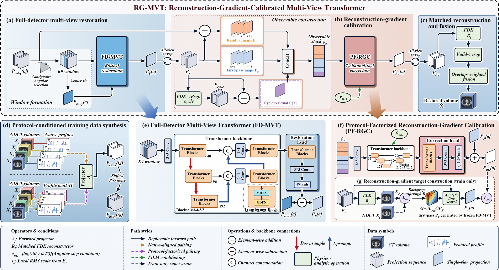

# RG-MVT

RG-MVT combines full-detector multi-view restoration (FD-MVT) with protocol-factored reconstruction-gradient calibration (PF-RGC), followed by matched FDK reconstruction and slice fusion for low-dose CT restoration.

Code, configurations, and pretrained weights have not yet been released. The workflow below describes the planned interface.



## 1. Environment Setup

Reference environment: Linux, Python 3.9, PyTorch 2.5.1 / CUDA 12.1, and CTorch 1.0. Run the following commands from the project root:

```bash
conda create -n rg_mvt python=3.9 -y
conda activate rg_mvt
python -m pip install torch==2.5.1 --index-url https://download.pytorch.org/whl/cu121
python -m pip install -r requirements.txt
```

Obtain the source from [AIAI-CTorch](https://github.com/JHU-AIAI-Shared/AIAI-CTorch) and install it with a compatible CUDA Toolkit and C++ compiler:

```bash
python -m pip install --no-build-isolation /path/to/AIAI-CTorch
```

## 2. Data Preparation

Select `siemens.yaml`, `ge.yaml`, `philips.yaml`, or `united_imaging.yaml` from `configs/`. Verify the acquisition parameters and set the input and output paths.

Inputs are **3D NPY volumes in Hounsfield units (HU), ordered as [z,y,x]**. Check voxel spacing, orientation, and grid dimensions against your data. Each preset defines a specific reference simulation protocol.

Edit the fields below in the selected configuration, retaining the remaining parameters:

```yaml
data:
  root: /path/to/ndct
  cases:
    - {case_id: case_001, patient_id: patient_001, ndct: case_001.npy, split: test}
run:
  output: ../runs/siemens
  device: cuda:0
  doses: [0.10]                   # 10% dose
  projection_cache: clean
```

`ndct` paths are relative to `data.root`; other paths are relative to the YAML file. Assign cases to train/val/test, keeping all scans from each patient in the same split.

## 3. Simulation

```bash
python simulate.py --config configs/siemens.yaml
```

Generate projections from NDCT, simulate noise, and reconstruct LDCT volumes with slice mappings. Example output: `runs/siemens/ldct/dose10/case_001.npy`.

Use `clean` to cache projections for training and testing, or `none` to save only LDCT images and metadata. Use `noisy` to cache fixed noisy projections, or `both` to retain both types. Projections are saved under `run.output/projections`; set `run.projection_dir` only to use a different location.

Simulation records the noise realization associated with each LDCT volume. Testing regenerates the same noisy projections from clean within the same validated numerical environment. Cache noisy projections when identical inputs are required across environments.

## 4. Training

Assign training cases to `train` and run simulation with clean projection caching. Then train the two stages:

```bash
python fd.py train --config configs/siemens.yaml
python pf.py train --config configs/siemens.yaml
```

Checkpoints are saved under `run.output/checkpoints`. PF training automatically loads the FD checkpoint from the current run, prepares the gradient-supervision targets, and trains PF-RGC. Retain the original NDCT volumes for target generation.

Training iterations, batch size, learning rate, and training doses are specified in the YAML configuration. Use the original case and protocol sets to reproduce the paper's native and cross-protocol training.

## 5. Testing

After simulation with clean or noisy projection caching, run:

```bash
python test.py --config configs/siemens.yaml
```

Testing uses the paired checkpoints from the current training run, or the supplied pretrained pair when no local training record exists. It restores test cases and reports PSNR, SSIM, and MAE.

Add `--mode infer` for reconstruction only, or `--mode evaluate` to evaluate existing results. Reference NDCT images are used for evaluation; inference uses projection inputs and recorded metadata.

## 6. Outputs

```text
runs/siemens/
  ldct/dose10/case_001.npy
  projections/clean/case_001/
  teacher/
  checkpoints/fd.pt
  checkpoints/pf.pt
  rg_mvt/dose10/case_001.npy
  rg_mvt/metrics/
```

`dose10` denotes 10% dose; filenames use case IDs. Output slices are automatically aligned with the original NDCT, retaining only the valid reconstruction range. Noise settings and slice mappings are stored as metadata.

Evaluation excludes only exterior air. SSIM is computed directly in HU, and CSV files store raw SSIM values.
